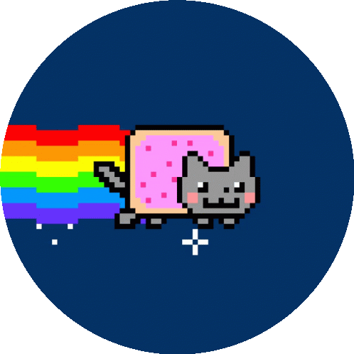

# rs-snake 🐍

`rs-snake` est une implémentation minimaliste et basique du jeu classique Snake, écrit entièrement en Rust et jouable directement dans le terminal. Redécouvrez le plaisir simple de ce jeu d'arcade classique directement dans votre terminal !

*`rs-snake` is a minimalist and basic implementation of the classic Snake game, written entirely in Rust and playable directly in the terminal. Rediscover the simple joy of this classic arcade game right in your terminal!*

## Caractéristiques / *Features*

- **Léger et rapide**: Écrit en Rust, `rs-snake` est optimisé pour la performance.
- **Basé sur le Terminal**: Pas besoin de GUI, jouez directement dans votre terminal favori.
- ***Lightweight and fast**: Written in Rust, rs-snake is optimized for performance.*
- ***Terminal-based**: No need for a GUI, play directly in your favorite terminal.*

## Dépendances / *Dependencies*
Assurez-vous d'avoir une version récente de [Rust](https://www.rust-lang.org/) et de Cargo installée.

*Ensure you have a recent version of [Rust](https://www.rust-lang.org/) and Cargo installed.*

## Compilation et exécution / *Compilation and Execution*

```bash
# Cloner le dépôt / Clone the repository
git clone https://github.com/alex-robert-fr/rs-snake.git
cd rs-snake

# Compiler et exécuter le jeu / Compile and run the game
cargo run --release
```

## Comment jouer / *How to Play*

 - **Flèches directionnelles** : Déplacez le serpent
 - **Q** : Quitter le jeu
 - ***Arrow keys**: Move the snake*
 - ***Q:** Quit the game*


 ## Licence / *License*
 `rs-snake` est sous licence MIT. Voir LICENSE pour plus d'informations.

 *`rs-snake` is licensed under MIT. See LICENSE for more details.*

 <br/>
 <br/>

 <p align="center">
    
</p>
